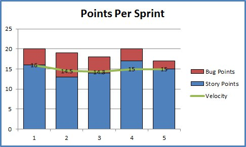

***
# IS3
### Ingeniería de Software 3

Licenciatura en Sistemas - Facultad de Informática - UNLP

<small>
**Lic. Christian Rodriguez**
 
<car@info.unlp.edu.ar>
 
 
 Esta obra
está bajo una <a rel="license"
href="http://creativecommons.org/licenses/by/4.0/">Licencia Creative Commons
Atribución 4.0 Internacional</a>.
</small>
***
***
# Contexto
---
## Según la propuesta de enseñanza

La clase a exponer será en el marco del caso de estudio planteado al inicio de la materia, que **no será** un caso **_real complejo_**, sino que apuntará a un pequeño sistema, o parte del mismo, con el fin de focalizar en las etapas necesarias para alcanzar las expectativas del cliente y no el del problema en sí que atacaría el sistema

---
## Qué conceptos se han expuesto

* La clase que vamos a exponer, cuenta con el conocimiento adquirido por los alumnos en los siguientes temas:
  * Presentación del caso de uso
  * Herramientas a utilizar
  * Repaso de las etapas del ciclo de vida de los sistemas
  * Presentación y comparación de los distintos modelos que pueden aplicarse en cada etapa del ciclo de vida.
    * La cátedra utilizará las **metodologías ágiles** y el **testing** como base
  * Análisis de requerimientos
---
## Consideraciones

* Habiendo expuesto los modelos existentes, y basándonos en la aplicación de metodologías ágiles, estamos determinando:
  * Qué roles cumplen los integrantes del equipo
  * Qué productos se generarán como entrada y salida de cada etapa
  * Qué procedimientos y herramientas se emplearán como apoyo para cada tarea
    * Independientemente del framework/lenguaje o arquitectura, TDD será parte de los procedimientos empleados
  * Criterios de evaluación del producto para saber si se han logrado los objetivos planteados

---
## Consideraciones

* La metodología planteada será SCRUM. Los conceptos detrás de la metodología ya han sido presentados en clases anteriores
* Se asumen sprints quincenales, para que las prácticas simulen el desempeño real del proyecto en conjunto con la cátedra
* En las primeras clases previas al inicio del proyecto, se ha determinado el **Product Backlog**, con sus respectivas estimaciones
***
***
## Seguimiento y Evaluación de Proyectos
---
## Introducción
Aplicando SCRUM ya se dispone de ciertas prácticas que preveen un manejo eficiente y performante de los proyectos.
Estas prácticas permiten tener un seguimiento diario y por sprint del estado del proyecto
---
## Lo que SCRUM ofrece
* Reuniones diarias donde cada miembro explica en qué ha estado trabajando desde la última reunión y qué planea realizar
* Reunión de inicio de sprint donde se determina el sprint backlog, siendo en sí una planificación a corto plazo de lo que se realizará en este sprint. Se planifica una nueva versión del producto
* Reunión de fin de sprint donde se revisa como ha sido el sprint que pasó. Se obtiene feedback del cliente que sirve como indicador de la calidad del trabajo realizado.
* Reunión retrospectiva donde se discuten las cuestiones que el equipo ha sabido llevar bien, como así aquellos aspectos que deben mejorarse.

---
## Tipos de Métricas

Veremos que tenemos diferentes instancias en las cuales medir el desempeño del equipo. No todas son métricas de gestión, algunas otras son de desarrollo, siendo cada una de ellas importantes para maximizar la calidad del producto final.
---
## Métricas de gestión
---
## Burndown
Permite analizar la evolución de un sprint en el tiempo respecto de la cantidad de trabajo pendiente, medido en puntos de historia u horas

---
## Burndown: antipatrones
* El equipo termina antes de tiempo porque no están asumiendo trabajo suficiente
* El equipo no cumple las previsiones porque están asumiendo demasiado trabajo
* La línea de evolución marca caídas pronunciadas en lugar de una evolución más gradual debido a que el trabajo no se ha dividido granularmente.
* El propietario del producto añade o cambia el alcance en mitad del sprint.
---
## Velocidad
La velocidad es la cantidad promedio de trabajo que un equipo completa durante un sprint, medida en puntos de historias u horas. Esta medida es muy útil para pronosticar

<small>
La velocidad de cada equipo es única. Si el equipo A tiene una velocidad de 50 y el equipo B tiene una velocidad de 75, **no significa** que el rendimiento de B sea mayor
</small>
---
## Velocidad: antipatrones

Si la velocidad experimenta muchas variaciones en un largo periodo de tiempo, deben revisarse las prácticas de estimación del equipo.

* En la reunión retrospectiva del equipo, debe consultarse:
  * ¿Hay dificultades de desarrollo no considerado al estimar el trabajo?
  * ¿Hay presión empresarial externa que empuja al equipo más allá de sus límites?
  * Como equipo, ¿somos demasiado optimistas al realizar previsiones de los sprints? 
  * ¿Hay mucho retrabajo por errores reportado por los usuarios?
---
## Seguimiento del desarrollo
---
## Introducción
Durante el desarrollo pueden emplearse diversas metodologías que afecten el flujo de trabajo por el cual se someterá el código antes de pasar a producción.

Generalmente las restricciones las impone la herramienta de versionado, no permitiendo la aceptación de código que no cumpla con determinados parámetros previamente definidos
---
## Análisis de código
* Una buena práctica durante el desarrollo, consiste en respetar estándares de codificación
* Cada lenguaje tiene sus particularidades, incluso los frameworks. Existen herramientas que analizan la calidad del código
* El flujo podría admitir únicamente código que se apegue a los estándares de codificación
---
## Tests antes del merge
* Utilizando TDD, el código incluye tests de unidad, integración y de ser posible de aceptación
* Es una buena práctica que los tests pasen antes de proceder a la incorporación de código
* Será responsabilidad de cada desarrollador, verificar la correctitud y completitud de los tests antes del merge de código
---
## Revisión de código previo al merge
* En los equipos siempre existen desarrolladores más experimentados que podrían supervisar la calidad del código que otros desarrolladores generen
* Este proceso es tedioso y complejo a la hora de realizar devoluciones sobre el código
  * Algunas herramientas han introducido mecanismos muy dinámicos y cómodos de intercambio de opiniones sobre algún cambio específico
  * Si se agrega la precondición de que pasen los tests, se aprovechará mejor el tiempo del supervisor
---
## Métricas en el desarrollo
* **Cobertura de los tests:** determina la cantidad de código cubierto por los tests desarrollados. Se desea mantener un porcentaje alto de cobertura
* **Cantidad de errores**: el retrabajo debe cuantificarse porque es desperdicio. Un error es trabajo imprevisto y evitable, que se inserta en un sprint
  * Implementar las prácticas antes mencionadas minimiza los errores
---
## El tiempo del despliegue
* Los desarrollos cada vez son más complejos en cuanto a su arquitectura. Esto complica la actualización del código, o la instalación del producto en ambientes de preproducción o QA
* Cuando el equipo responde con cierta velocidad, pero los despliegues se atrasan, la velocidad se ve afectada
* La automatización y normalización de ambientes entre desarrollo y producción son la solución.
* Es deseable implementar:
  * Integración continua
  * Entrega continua
  * Despliegue continuo
---
## Aplicación en el caso de uso
Para instanciar la problemática de realizar un seguimiento y evaluación del proyecto de nuestro caso de uso, se muestra la forma en que se obtienen las métricas antes mencionadas con las herramientas propuestas en talleres previos.

Además se definen pipelines de automatización para lograr integración continua.
***
